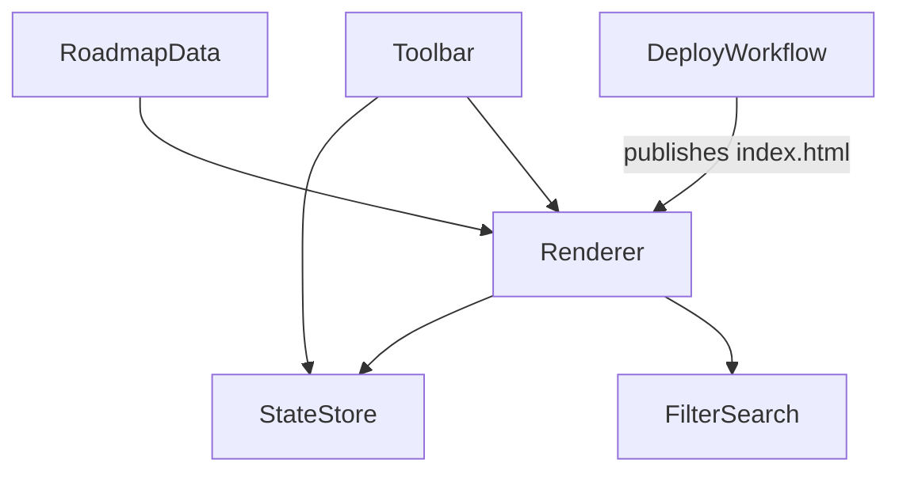

# AI_ENGINNER — Architecture

## 1. Stack
- Single static HTML file: HTML5 + inline CSS3 (custom properties, `data-theme` light/dark) + vanilla JavaScript (ES6+).
- No framework, no build step, no package manager — "no dependencies" (README.md).
- Persistence: browser `localStorage` only — no backend, nothing sent anywhere (README.md, index.html).
- Deploy: GitHub Actions → GitHub Pages (`.github/workflows/deploy.yml`, per README.md).

## 2. Directory map
| path | what lives there |
| --- | --- |
| `index.html` | Entire app: markup, CSS, and JS — content data, DOM renderer, state store, filter/search, toolbar |
| `.github/workflows/` | `deploy.yml` — GitHub Pages deploy workflow, runs on push to `main` (README.md) |
| `README.md` | Local-view, deploy, and "editing the checklist" instructions |

## 3. Diagram

## 4. Component index
- [[RoadmapData]]
- [[Renderer]]
- [[StateStore]]
- [[FilterSearch]]
- [[Toolbar]]
- [[DeployWorkflow]]

## 5. Entry points
- Dev: open `index.html` directly (`open index.html` on macOS), or serve it with `python3 -m http.server 8000` (README.md).
- Prod: GitHub Pages, published from `index.html` on every push to `main` via `.github/workflows/deploy.yml`; live at `https://alphaman-0.github.io/AI_ENGINNER/` (README.md).

## 6. Conventions
- Everything lives in one self-contained file, `index.html` — HTML + CSS + JS, no external dependencies (README.md).
- Roadmap content is data, not markup: tasks live in the `DATA` array as `{ t, cat, tag, links }` objects; `cat` sets filter color, `tag` renders a badge, `links` is optional (README.md, index.html `DATA`).
- Task identity is a stable hash of task text (`hash()`, djb2 in index.html) — reordering is safe, but editing an item's text resets its checked state (README.md, index.html).
- Theming via CSS custom properties on `:root`, overridden under `:root[data-theme="light"]`; toggled by setting `data-theme` on `<html>` (index.html `<style>`, `setTheme()`).
- `localStorage` keys are namespaced with a `genai-roadmap-` prefix: `STORE_KEY`, `THEME_KEY`, `OPEN_KEY` (index.html).

## 7. Where things go
- Add/edit a roadmap task: edit the `DATA` array inside `index.html`'s `<script>` (README.md "Editing the checklist").
- Add a new category/filter chip: add an entry to the `CATS` object in `index.html`, then reference its key as `cat` on `DATA` items.
- Change deploy behavior: edit `.github/workflows/deploy.yml`.
- Change theme colors/layout: edit the CSS custom properties and rules in `index.html`'s `<style>` block.
- Change what's persisted or how: edit `STORE_KEY` / `THEME_KEY` / `OPEN_KEY` and the `load()` / `save()` functions in `index.html`.
